# AI-Powered Graph Analytics Platform

**Autonomous AI agents transform business requirements into graph insights**

[](https://www.python.org/downloads/)
[](https://opensource.org/licenses/MIT)
[](https://github.com/ArthurKeen/graph-analytics-ai)

Transform business requirements into actionable graph analytics insights with AI-powered automation. Choose between a traditional workflow orchestrator for full control or an autonomous agentic system for hands-off execution. From requirements documents to intelligence reports in minutes, not weeks.

---

##  Key Features

**Three Workflow Modes** 


- **Traditional Orchestrator**: Step-by-step control, easy to understand and debug
- **Agentic System**: Autonomous AI agents with self-healing and intelligent routing
- ** Parallel Agentic** (v3.1.0): All benefits of agentic PLUS 40-60% faster execution
- Use the approach that fits your needs - all are production-ready

**Complete AI-Powered Pipeline**
- Requirements (PDF/DOCX/Text) → Schema Analysis → Use Cases → Templates → Execution → Intelligence Reports
- LLM-powered decision making at every step
- Algorithm-aware collection selection (WCC excludes satellites, PageRank uses full graph)
- Fully automated or manually controlled - your choice

**Production Ready**
- Real ArangoDB AMP cluster integration
- Graph Analytics Engine (GAE) support
- Multiple LLM providers (OpenAI, Anthropic, Gemini)
- Enterprise-grade error handling and checkpointing

**Intelligent Output**
- Actionable intelligence reports with business context
- **Interactive HTML reports with embedded Plotly charts** 
- Insights with confidence scores and supporting evidence
- Prioritized recommendations with effort/impact estimates
- Multiple formats (Markdown, JSON, HTML, Text)

**Analysis Catalog** (NEW v3.2.0)

Comprehensive tracking system for all analysis executions with complete lineage and time-series capabilities.

**Core Features:**
- **Execution Tracking**: Every analysis run with algorithm, parameters, results, and performance metrics
- **Complete Lineage**: Full chain tracking from Requirements → Use Cases → Templates → Executions
- **Time-Series Analysis**: Track graph evolution over time with epochs (e.g., weekly/monthly snapshots)
- **Impact Analysis**: Understand what changes when requirements change
- **Performance Comparison**: Compare algorithm performance across runs and configurations
- **Universal Support**: Works seamlessly with all three workflow modes (Traditional, Agentic, Parallel)

**Data Model:**
- 5 ArangoDB collections with optimized indexes
- Star schema design for fast queries
- Complete foreign key relationships for lineage
- Flexible metadata storage

**Use Cases:**
- Track PageRank changes as your graph evolves
- Compare algorithm performance across different configurations
- Audit which analyses have been run and when
- Understand the impact of requirement changes
- Generate time-series reports on graph metrics

**Documentation:**
- [Quick Start Guide](docs/ANALYSIS_CATALOG_SUMMARY.md)
- [Complete Graph Schema](docs/ANALYSIS_CATALOG_GRAPH_SCHEMA.md)
- [API Reference](docs/ANALYSIS_CATALOG_PROJECT_COMPLETE.md)

---

##  Quick Start

### Installation

```bash
# Clone repository
git clone https://github.com/ArthurKeen/graph-analytics-ai.git
cd graph-analytics-ai

# Install dependencies
pip install -e .

# Configure environment
cp .env.example .env
# Edit .env with your credentials
```

### Configuration

Create a `.env` file:

```env
# ArangoDB Configuration
ARANGO_ENDPOINT=https://your-cluster.arangodb.cloud:8529
ARANGO_DATABASE=your_database
ARANGO_USER=root
ARANGO_PASSWORD=your_password

# For GAE (ArangoDB Managed Platform)
GAE_DEPLOYMENT_MODE=amp
ARANGO_GRAPH_API_KEY_ID=your_api_key_id
ARANGO_GRAPH_API_KEY_SECRET=your_api_key_secret

# LLM Configuration (choose one)
LLM_PROVIDER=openai  # or anthropic, gemini

# OpenAI
OPENAI_API_KEY=your_openai_key
OPENAI_MODEL=gpt-4

# Anthropic
ANTHROPIC_API_KEY=your_anthropic_key
ANTHROPIC_MODEL=claude-3-sonnet-20240229

# Google Gemini
GOOGLE_API_KEY=your_google_key
GEMINI_MODEL=gemini-pro
```

### Run Your First Workflow

The platform offers three ways to run analytics workflows, each suited for different use cases:

1. **Traditional Workflow** - Step-by-step control with explicit orchestration. Best for learning the platform, debugging, or building custom pipelines.
2. **Agentic Workflow** - Autonomous AI agents handle everything automatically. Best for production deployments and hands-off automation.
3. **Parallel Agentic Workflow** - Same autonomous execution but 40-60% faster with parallel processing. Best for performance-critical applications.

Choose the approach that fits your needs:

**Option 1: Traditional Workflow (Recommended for learning)**

```python
from graph_analytics_ai.ai.workflow import WorkflowOrchestrator

# Initialize orchestrator
orchestrator = WorkflowOrchestrator(graph_name="your_graph")

# Run complete workflow with full control
result = orchestrator.run_complete_workflow(
    input_files=["requirements.pdf"]
)

# Access results
print(f"Status: {result.status}")
print(f"Generated {len(result.reports)} reports")
```

**Option 2: Agentic Workflow (Autonomous)**

```python
from graph_analytics_ai.ai.agents import AgenticWorkflowRunner

# One-line autonomous execution
runner = AgenticWorkflowRunner(graph_name="your_graph")
state = runner.run()

# AI agents handle everything automatically
print(f"Generated {len(state.reports)} reports")
```

**Option 3: Parallel Agentic Workflow (Fastest) **

```python
import asyncio
from graph_analytics_ai.ai.agents import AgenticWorkflowRunner

async def main():
    runner = AgenticWorkflowRunner(graph_name="your_graph")
    # 40-60% faster with parallel execution!
    state = await runner.run_async(enable_parallelism=True)
    print(f"Generated {len(state.reports)} reports")

asyncio.run(main())
```

**All workflows execute the same pipeline:**
1. Analyze your graph schema
2. Extract business requirements
3. Generate analytics use cases
4. Create optimized GAE templates
5. Execute analyses on your cluster
6. Generate actionable intelligence reports

---

##  Choosing Your Workflow Mode

### Traditional Orchestrator - Step-by-Step Control

**When to use:**
- Learning the platform
- Building custom pipelines
- Need granular control
- Debugging and testing
- Integrating specific steps into existing systems

**Complete workflow:**

```python
from graph_analytics_ai.ai.workflow import WorkflowOrchestrator

# Initialize with configuration
orchestrator = WorkflowOrchestrator(
    graph_name="ecommerce_graph",
    checkpoint_dir="./checkpoints",
    enable_retry=True
)

# Run complete workflow with checkpointing
result = orchestrator.run_complete_workflow(
    input_files=["requirements.pdf"]
)

# Access detailed results
for step_name, step_result in result.steps.items():
    print(f"{step_name}: {step_result.status}")
    
print(f"\nGenerated {len(result.reports)} reports")
```

**Individual module usage:**

```python
# Or use modules individually for custom pipelines
from graph_analytics_ai.ai.schema import SchemaExtractor, SchemaAnalyzer
from graph_analytics_ai.ai.generation import UseCaseGenerator
from graph_analytics_ai.ai.templates import TemplateGenerator
from graph_analytics_ai.ai.execution import AnalysisExecutor
from graph_analytics_ai.ai.reporting import ReportGenerator

# Build your own workflow
extractor = SchemaExtractor(db_connection)
schema = extractor.extract()

analyzer = SchemaAnalyzer()
analysis = analyzer.analyze(schema)

# ... continue with your custom logic
```

**Benefits:**
- Full control over each step
- Easy to understand and debug
- Checkpoint and resume support
- Integrate into existing pipelines
- Explicit error handling

---

### Agentic Workflow - Autonomous Intelligence

**When to use:**
- Production deployments
- Hands-off automation
- Complex multi-step scenarios
- Need self-healing workflows
- Want explainable AI decisions

**Complete autonomous execution:**

```python
from graph_analytics_ai.ai.agents import AgenticWorkflowRunner

# One-line autonomous execution
runner = AgenticWorkflowRunner(graph_name="ecommerce_graph")
state = runner.run()

# Agents handle everything:
# - SchemaAnalyst: Analyzes graph structure
# - RequirementsAnalyst: Extracts business needs
# - UseCaseExpert: Generates analytics use cases
# - TemplateEngineer: Creates GAE configurations
# - ExecutionSpecialist: Runs analyses on cluster
# - ReportingSpecialist: Generates insights

print(f"Workflow Status: {state.status}")
for report in state.reports:
    print(f"\n{report.title}")
    for insight in report.insights:
        print(f"  - {insight.title} (confidence: {insight.confidence:.0%})")
```

**Agent communication example:**
```
[Orchestrator] Starting workflow
[SchemaAnalyst] Extracted: 3 vertex collections, 5 edge collections
[RequirementsAnalyst] Extracted: 1 objective, 3 requirements
[UseCaseExpert] Generated 2 use cases (PageRank, Community Detection)
[TemplateEngineer] Created 2 optimized templates
[ExecutionSpecialist] Completed analyses in 2.8s
[ReportingSpecialist] Generated 2 intelligence reports
[Orchestrator] Workflow complete - Success!
```

**Benefits:**
- Autonomous decision-making
- Self-healing error recovery
- Explainable AI (agent messages)
- Adaptive workflow routing
- Domain expertise per agent
- Minimal configuration required

---

## Architecture

### Core Pipeline

Both workflow modes execute the same underlying pipeline:


### Workflow Mode Comparison

**Traditional Orchestrator**
- Sequential step execution with checkpointing
- Full programmatic control over each phase
- Easy to debug and customize
- Direct module integration
- Perfect for custom pipelines

**Agentic System**
- 6 specialized AI agents with domain expertise
- Supervisor pattern for intelligent coordination
- Self-healing error recovery
- Explainable AI decision-making
- Autonomous workflow adaptation

**Parallel Agentic Workflow** (v3.1.0) 
- All benefits of agentic system PLUS:
- 40-60% faster execution
- Parallel schema + requirements analysis
- Concurrent template execution
- Simultaneous report generation

### Agentic Workflow Architecture

The agentic system uses 6 specialized AI agents coordinated by a supervisor:

```mermaid
graph TB
    subgraph "Agentic Workflow System"
        Orch[Orchestrator Agent<br/>Supervisor Pattern<br/>• Coordinates all agents<br/>• Intelligent routing<br/>• Error recovery]
        
        Schema[Schema Analyst<br/>Graph DB Expert<br/>• Extracts structure<br/>• Analyzes patterns]
        
        Req[Requirements Analyst<br/>Business Expert<br/>• Parses documents<br/>• Extracts needs]
        
        UseCase[Use Case Expert<br/>Analytics Consultant<br/>• Maps to algorithms<br/>• Prioritizes value]
        
        Template[Template Engineer<br/>Configuration Expert<br/>• Optimizes parameters<br/>• Validates templates]
        
        Exec[Execution Specialist<br/>Operations Expert<br/>• Runs analyses<br/>• Monitors progress]
        
        Report[Reporting Specialist<br/>BI Expert<br/>• Generates insights<br/>• Creates reports]
    end
    
    Orch --> Schema
    Orch --> Req
    Schema --> UseCase
    Req --> UseCase
    UseCase --> Template
    Template --> Exec
    Exec --> Report
    
    Schema -.->|result| Orch
    Req -.->|result| Orch
    UseCase -.->|result| Orch
    Template -.->|result| Orch
    Exec -.->|result| Orch
    Report -.->|result| Orch
    
    style Orch fill:#e1f5ff,stroke:#01579b,stroke-width:3px
    style Schema fill:#fff9c4,stroke:#f57f17,stroke-width:2px
    style Req fill:#fff9c4,stroke:#f57f17,stroke-width:2px
    style UseCase fill:#f3e5f5,stroke:#7b1fa2,stroke-width:2px
    style Template fill:#e0f2f1,stroke:#00796b,stroke-width:2px
    style Exec fill:#ffe0b2,stroke:#e65100,stroke-width:2px
    style Report fill:#c5e1a5,stroke:#558b2f,stroke-width:2px
```



### Parallel Execution Architecture (v3.1.0)

**40-60% performance improvement** through intelligent parallelization:


**Performance Gains:**
-  **Initial Analysis**: Schema + Requirements run in parallel → 2x faster
-  **Template Execution**: All templates execute concurrently → Nx faster
-  **Report Generation**: All reports generate simultaneously → Nx faster
-  **Overall**: 40-60% total time reduction

**Usage:**
```python
import asyncio
from graph_analytics_ai.ai.agents import AgenticWorkflowRunner

async def main():
    runner = AgenticWorkflowRunner(
        graph_name="your_graph",
        enable_tracing=True  # See performance metrics
    )
    
    # Parallel execution (default)
    state = await runner.run_async(enable_parallelism=True)
    
    # View performance improvements
    runner.print_trace_summary()

asyncio.run(main())
```

**Agent Responsibilities:**

| Agent | Role | Tools |
|-------|------|-------|
| **Orchestrator** | Supervisor, routing, error recovery | All agent coordination |
| **Schema Analysis** | Extract graph structure | Database queries, LLM analysis |
| **Requirements** | Parse business needs | Document parsing, LLM extraction |
| **Use Case** | Map needs to algorithms | LLM reasoning, algorithm selection |
| **Template** | Generate GAE configurations | Collection selection, parameter optimization |
| **Execution** | Run analyses on GAE | GAE API, result validation |
| **Reporting** | Generate insights | LLM interpretation, chart generation |

### Technology Stack

- **Python 3.8+** - Core platform
- **ArangoDB** - Graph database
- **GAE (Graph Analytics Engine)** - Analysis execution
- **LLM Providers** - OpenAI, Anthropic, Google Gemini
- **Python-Arango** - Database driver
- **Click** - CLI interface

---

##  CLI Interface

The platform includes a comprehensive CLI supporting both workflow modes:

```bash
# Check version
gaai version

# Run traditional workflow (with checkpointing)
gaai run-workflow \
  --database graph_db \
  --graph my_graph \
  --input requirements.pdf \
  --output results/ \
  --checkpoint checkpoints/

# Run agentic workflow (autonomous)
gaai run-workflow \
  --database graph_db \
  --graph my_graph \
  --input requirements.pdf \
  --mode agentic \
  --output results/

# Use individual modules
gaai analyze-schema \
  --database graph_db \
  --output schema.json

gaai parse-requirements \
  --input requirements.pdf \
  --output requirements.json

# Check workflow status
gaai status --checkpoint checkpoint.json
```

### 🛠️ CLI Utilities (NEW in v3.0+)

The library now includes reusable command-line utilities for common tasks:

**Token Management:**
```bash
# Get or refresh OASIS token for AMP authentication
python -m graph_analytics_ai.auth.oasis_token_helper

# Check token status
python -m graph_analytics_ai.auth.oasis_token_helper --status

# Force refresh
python -m graph_analytics_ai.auth.oasis_token_helper --refresh
```

**Connection Testing:**
```bash
# Test and verify database connection
python -m graph_analytics_ai.cli.test_connection
```

**GAE Management:**
```bash
# List and cleanup GAE engines
python -m graph_analytics_ai.cli.gae_cleanup
```

**Python API:**
```python
from graph_analytics_ai.auth import get_or_refresh_token
from graph_analytics_ai.cli.test_connection import test_connection

# Get authentication token
token = get_or_refresh_token()

# Test connection
if test_connection():
    print("Ready to run workflow!")
```

📖 **Full Documentation:** [CLI Utilities Guide](docs/CLI_UTILITIES_GUIDE.md)

---

##  Examples

### Example 1: Complete Workflow (Traditional)

```python
from graph_analytics_ai.ai.workflow import WorkflowOrchestrator

# Initialize orchestrator
orchestrator = WorkflowOrchestrator(
    graph_name="ecommerce_graph",
    checkpoint_dir="./checkpoints"
)

# Run complete workflow with full control
result = orchestrator.run_complete_workflow(
    input_files=["business_requirements.pdf"]
)

# Check status and access results
if result.success:
    print(f"Workflow completed successfully!")
    print(f"Generated {len(result.reports)} reports")
    
    for report in result.reports:
        print(f"\n{report.title}")
        print(f"  Insights: {len(report.insights)}")
        print(f"  Recommendations: {len(report.recommendations)}")
else:
    print(f"Workflow failed: {result.error}")
```

### Example 2: E-commerce Analytics (Agentic)

```python
from graph_analytics_ai.ai.agents import AgenticWorkflowRunner

# One-line autonomous execution
runner = AgenticWorkflowRunner(graph_name="ecommerce_graph")
state = runner.run()

# Results: Customer influence analysis, product recommendations, etc.
for report in state.reports:
    print(f"\n{report.title}")
    for insight in report.insights:
        print(f"  - {insight.title} (confidence: {insight.confidence*100:.0f}%)")
```

### Example 3: Custom Module Integration

Build your own pipeline using individual modules:

```python
from graph_analytics_ai.db_connection import get_db_connection
from graph_analytics_ai.ai.schema import SchemaExtractor, SchemaAnalyzer
from graph_analytics_ai.ai.generation import UseCaseGenerator
from graph_analytics_ai.ai.templates import TemplateGenerator
from graph_analytics_ai.ai.execution import AnalysisExecutor
from graph_analytics_ai.ai.reporting import ReportGenerator

# Step 1: Extract schema
db = get_db_connection()
extractor = SchemaExtractor(db)
schema = extractor.extract()

# Step 2: Analyze schema
analyzer = SchemaAnalyzer()
analysis = analyzer.analyze(schema)

# Step 3: Create custom requirements
from graph_analytics_ai.ai.documents.models import (
    ExtractedRequirements, Objective, Priority
)

requirements = ExtractedRequirements(
    domain="Social Network",
    summary="Find key influencers",
    objectives=[
        Objective(
            id="OBJ-001",
            title="Identify Top Influencers",
            priority=Priority.CRITICAL
        )
    ]
)

# Step 4: Generate use cases
uc_generator = UseCaseGenerator()
use_cases = uc_generator.generate(requirements, analysis)

# Step 5: Generate templates
template_gen = TemplateGenerator(graph_name="social_network")
templates = template_gen.generate_templates(use_cases, schema, analysis)

# Step 6: Execute and report
executor = AnalysisExecutor()
report_gen = ReportGenerator()

for template in templates:
    result = executor.execute_template(template, wait=True)
    if result.success:
        report = report_gen.generate_report(result)
        print(f"\n{report.title}")
        print(report.summary)
```

### Example 5: Report Generation

```python
from graph_analytics_ai.ai.reporting import ReportGenerator, ReportFormat

generator = ReportGenerator()
report = generator.generate_report(execution_result)

# Export in different formats
markdown = generator.format_report(report, ReportFormat.MARKDOWN)
json_output = generator.format_report(report, ReportFormat.JSON)
html = generator.format_report(report, ReportFormat.HTML)

# Save
with open('report.md', 'w') as f:
    f.write(markdown)
```

### Example 6: Interactive HTML Reports with Charts  NEW

```python
from graph_analytics_ai.ai.reporting import (
    ReportGenerator, 
    HTMLReportFormatter,
    is_plotly_available
)

# Check if charts are available
if is_plotly_available():
    # Generate report with interactive charts
    generator = ReportGenerator(enable_charts=True)
    report = generator.generate_report(execution_result, context={
        "use_case": {"title": "Network Analysis"},
        "requirements": {"domain": "social network"}
    })
    
    # Format as HTML with embedded Plotly charts
    html_formatter = HTMLReportFormatter()
    charts = report.metadata.get('charts', {})
    html_content = html_formatter.format_report(report, charts=charts)
    
    # Save interactive HTML report
    with open('report.html', 'w') as f:
        f.write(html_content)
    
    print(f" Generated report with {len(charts)} interactive charts!")
    # Charts include:
    # - Top influencers/components bar charts
    # - Distribution histograms (log-scale)
    # - Connectivity pie charts
    # - Fully interactive (hover, zoom, pan)
else:
    print("Install plotly for interactive charts: pip install plotly")
```

**Chart Types by Algorithm:**
- **PageRank**: Top influencers, rank distribution, cumulative influence
- **WCC**: Component sizes, distribution, connectivity overview
- **Betweenness**: Bridge nodes, centrality distribution
- **Label Propagation**: Community sizes, distribution

See [Interactive Report Generation Guide](docs/INTERACTIVE_REPORT_GENERATION.md) for details.

---

##  Advanced Configuration

### Custom LLM Configuration

```python
from graph_analytics_ai.ai.llm import create_llm_provider

# Custom provider
provider = create_llm_provider(
    provider_type="openai",
    model="gpt-4-turbo-preview",
    temperature=0.7,
    max_tokens=2000
)

# Use in agents
from graph_analytics_ai.ai.agents import AgenticWorkflowRunner
runner = AgenticWorkflowRunner(llm_provider=provider)
```

### Custom Agent Configuration

```python
from graph_analytics_ai.ai.agents import OrchestratorAgent
from graph_analytics_ai.ai.agents.specialized import SchemaAnalysisAgent

# Create custom agents
schema_agent = SchemaAnalysisAgent(
    llm_provider=provider,
    db_connection=db
)

# Build custom orchestrator
orchestrator = OrchestratorAgent(
    llm_provider=provider,
    agents={"SchemaAnalyst": schema_agent, ...}
)
```

### Workflow Customization

```python
from graph_analytics_ai.ai.workflow import WorkflowOrchestrator

orchestrator = WorkflowOrchestrator(
    llm_provider=provider,
    db_connection=db,
    checkpoint_dir="./checkpoints",
    enable_retry=True,
    max_retries=3
)

result = orchestrator.run_complete_workflow(
    input_files=["requirements.pdf"],
    graph_name="my_graph"
)
```

### Algorithm-Specific Collection Selection

Different algorithms require different graph subsets. The platform automatically selects appropriate collections:

```python
from graph_analytics_ai.ai.templates import TemplateGenerator

# Specify which collections are satellite/core
generator = TemplateGenerator(
    graph_name="my_graph",
    satellite_collections=["metadata", "configs", "lookup_tables"],
    core_collections=["users", "products", "orders"]
)

# WCC will exclude satellites (find core components)
# PageRank will include everything (full graph importance)
# Betweenness will include everything (accurate centrality)
templates = generator.generate_templates(use_cases, schema)

# Check what was selected
for template in templates:
    print(f"{template.name}: {template.config.vertex_collections}")
    print(f"Reasoning: {template.metadata['collection_selection_reasoning']}")
```

**See the [Collection Selection Guide](docs/COLLECTION_SELECTION_GUIDE.md) for details.**

---

##  Example Output

### Intelligence Report

```markdown
# Analysis Report: Customer Influence Analysis

*Generated: 2025-12-12 18:00:00*

## Executive Summary

Analysis of 500 customers using PageRank algorithm. 
Identified 50 high-influence customers (top 10%).
Generated 3 key insights and 2 high-priority recommendations.

## Key Insights

### 1. Top Influencers Identified (Confidence: 95%)

Discovered 50 customers with exceptional influence scores.
Average score: 0.0234. Top influencer: customer_42 (0.0456).

**Business Impact:** Focus engagement campaigns on these 50 
customers for maximum ROI. Estimated 25% increase in conversion.

### 2. Power-Law Distribution Detected (Confidence: 88%)

Influence follows power-law: top 20% accounts for 80% of 
total influence.

**Business Impact:** Implement tiered engagement strategy.
Optimize resources by focusing on high-value segments.

## Recommendations

### High Priority

**1. Launch VIP Program**
Create exclusive program for top 50 influencers.
- Priority: High
- Effort: Medium  
- Expected Impact: 25% engagement increase

**2. Monitor Influence Changes**
Track influence scores monthly to detect shifts.
- Priority: High
- Effort: Low
- Expected Impact: Early trend detection, proactive engagement
```

---

## 🧪 Testing

```bash
# Run all tests
pytest

# Run specific test suite
pytest tests/unit/ai/agents/

# Run with coverage
pytest --cov=graph_analytics_ai tests/

# Run integration tests (requires cluster)
pytest tests/integration/
```

---

##  Performance

### Parallel Execution Performance (v3.1.0)

** 40-60% faster** with parallel agentic workflow:

```mermaid
gantt
    title Workflow Execution Time Comparison
    dateFormat X
    axisFormat %s
    
    section Sequential v3.0
    Schema Analysis       :done, 0, 20s
    Requirements          :done, 20s, 40s
    Use Case Generation   :done, 40s, 65s
    Template Generation   :done, 65s, 85s
    Execute Template 1    :done, 85s, 100s
    Execute Template 2    :done, 100s, 115s
    Execute Template 3    :done, 115s, 130s
    Execute Template 4    :done, 130s, 145s
    Execute Template 5    :done, 145s, 160s
    Report 1              :done, 160s, 167s
    Report 2              :done, 167s, 174s
    Report 3              :done, 174s, 181s
    Report 4              :done, 181s, 188s
    Report 5              :done, 188s, 195s
    
    section Parallel v3.1
    Schema Analysis       :done, p1, 0, 22s
    Requirements          :done, p2, 0, 22s
    Use Case Generation   :done, 22s, 47s
    Template Generation   :done, 47s, 67s
    Execute (all 5)       :crit, 67s, 87s
    Reports (all 5)       :crit, 87s, 97s
```

**Performance Comparison** (5 templates, 5 reports):

| Metric | Sequential v3.0 | Parallel v3.1 | Improvement |
|--------|----------------|---------------|-------------|
| **Phase 1** (Schema + Reqs) | 40s | 22s | **45% faster** |
| **Phase 4** (5 Executions) | 75s | 20s | **73% faster** |
| **Phase 5** (5 Reports) | 35s | 10s | **71% faster** |
| **Total Time** | 195s | 97s | ** 50% faster** |
| **LLM Calls** | 15 | 15 | Same |
| **Cost** | $0.045 | $0.045 | Same |

**Key Benefits:**
-  **Faster results**: Get insights in half the time
-  **Same cost**: No additional LLM or compute costs
-  **Same quality**: Identical outputs, just faster
-  **Scalable**: Benefit increases with more templates

### Traditional Workflow Benchmarks

| Workflow | Documents | Templates | Execution | Total Time |
|----------|-----------|-----------|-----------|------------|
| Small    | 1K nodes  | 2         | 2.5s      | ~8s        |
| Medium   | 10K nodes | 5         | 12s       | ~25s       |
| Large    | 100K nodes| 10        | 45s       | ~90s       |

*Benchmarks on ArangoDB AMP e16 engine*

### Scalability

-  Handles graphs up to 10M+ nodes
-  **Parallel agent execution (v3.1.0)**
-  Batch analysis support
-  Checkpointing for long-running workflows

**Enable Parallel Execution:**
```python
import asyncio
from graph_analytics_ai.ai.agents import AgenticWorkflowRunner

async def main():
    runner = AgenticWorkflowRunner(enable_tracing=True)
    state = await runner.run_async(enable_parallelism=True)
    
    # View performance metrics
    runner.print_trace_summary()

asyncio.run(main())
```

---

##  Development

### Project Structure

```
graph-analytics-ai/
├── graph_analytics_ai/          # Main package
│   ├── ai/                       # AI components
│   │   ├── agents/              # Agentic workflow (Phase 10)
│   │   │   ├── base.py          # Agent framework
│   │   │   ├── orchestrator.py  # Supervisor agent
│   │   │   ├── specialized.py   # Domain agents
│   │   │   └── runner.py        # Workflow runner
│   │   ├── llm/                 # LLM abstraction (Phase 1)
│   │   ├── schema/              # Schema analysis (Phase 2)
│   │   ├── documents/           # Document processing (Phase 3)
│   │   ├── prd/                 # PRD generation (Phase 4)
│   │   ├── generation/          # Use case generation (Phase 5)
│   │   ├── workflow/            # Workflow orchestration (Phase 6)
│   │   ├── templates/           # Template generation (Phase 7)
│   │   ├── execution/           # Analysis execution (Phase 8)
│   │   └── reporting/           # Report generation (Phase 9)
│   ├── db_connection.py         # Database utilities
│   └── cli.py                   # CLI interface
├── tests/                       # Test suite
├── examples/                    # Example scripts
├── docs/                        # Documentation
└── scripts/                     # Utility scripts
```

### Contributing

1. Fork the repository
2. Create a feature branch (`git checkout -b feature/amazing-feature`)
3. Commit your changes (`git commit -m 'Add amazing feature'`)
4. Push to the branch (`git push origin feature/amazing-feature`)
5. Open a Pull Request

### Coding Standards

- **PEP 8** compliance
- **Type hints** for all functions
- **Docstrings** for all public APIs
- **Tests** for all new features
- **90%+ test coverage**

---

##  Documentation

- **[Architecture Overview](docs/ARCHITECTURE.md)** - System design
- **[API Reference](docs/API.md)** - Complete API documentation
- **[Workflow Guide](docs/WORKFLOW_ORCHESTRATION.md)** - Workflow details
- **[Agent System](docs/AGENTS.md)** - Agentic architecture
- ** [Parallel Execution Guide](docs/PARALLEL_EXECUTION_GUIDE.md)** - Async/parallel workflow (40-60% faster!)
- **[Examples](examples/)** - Code examples

---

##  Platform Features by Phase

| Phase | Feature | Status |
|-------|---------|--------|
| 1 | LLM Foundation |  Complete |
| 2 | Schema Analysis |  Complete |
| 3 | Document Processing |  Complete |
| 4 | PRD Generation |  Complete |
| 5 | Use Case Generation |  Complete |
| 6 | Workflow Orchestration |  Complete |
| 7 | Template Generation |  Complete |
| 8 | Analysis Execution |  Complete |
| 9 | Report Generation |  Complete |
| 10 | Agentic Workflow |  Complete |

**Progress: 100% (10/10 phases)** 

---

##  Use Cases

### 1. E-commerce
- Customer influence analysis
- Product recommendation optimization
- Purchase pattern detection
- Churn prediction

### 2. Social Networks
- Influencer identification
- Community detection
- Content propagation analysis
- Network growth modeling

### 3. Fraud Detection
- Transaction network analysis
- Anomaly detection
- Risk scoring
- Pattern recognition

### 4. Knowledge Graphs
- Entity relationship analysis
- Path discovery
- Semantic similarity
- Knowledge extraction

---

##  License

This project is licensed under the MIT License - see the [LICENSE](LICENSE) file for details.

---

##  Acknowledgments

- **ArangoDB** - Graph database and GAE platform
- **OpenAI** - GPT models
- **Anthropic** - Claude models
- **Google** - Gemini models

---

##  Support

- **Issues**: [GitHub Issues](https://github.com/ArthurKeen/graph-analytics-ai/issues)
- **Discussions**: [GitHub Discussions](https://github.com/ArthurKeen/graph-analytics-ai/discussions)
- **Email**: support@graph-analytics-ai.com

---

##  Roadmap

### Completed 
- [x] LLM abstraction layer
- [x] Schema analysis
- [x] Document processing
- [x] PRD generation
- [x] Use case generation
- [x] Workflow orchestration
- [x] Template generation
- [x] Analysis execution
- [x] Report generation
- [x] Agentic workflow

### Future Enhancements 
- [ ] Parallel agent execution
- [ ] Agent learning from history
- [ ] Human-in-the-loop workflows
- [ ] Advanced visualization
- [ ] Real-time monitoring dashboard
- [ ] Multi-tenant support
- [ ] Cloud deployment templates

---

##  Statistics

- **~15,000+** lines of production code
- **2** workflow modes (traditional orchestrator + agentic)
- **6** specialized AI agents (for agentic mode)
- **7** core modules (schema, documents, PRD, use cases, templates, execution, reporting)
- **10** complete implementation phases
- **90%+** test coverage
- **4** LLM providers supported (OpenAI, Anthropic, Gemini, + custom)
- **Multiple** output formats (Markdown, JSON, HTML, Text)

---

##  Star History

If you find this project useful, please consider giving it a star! 

---

**Built with  by the Graph Analytics AI team**

**Version 3.0.0** | **100% Complete** | **Production Ready** 

---

