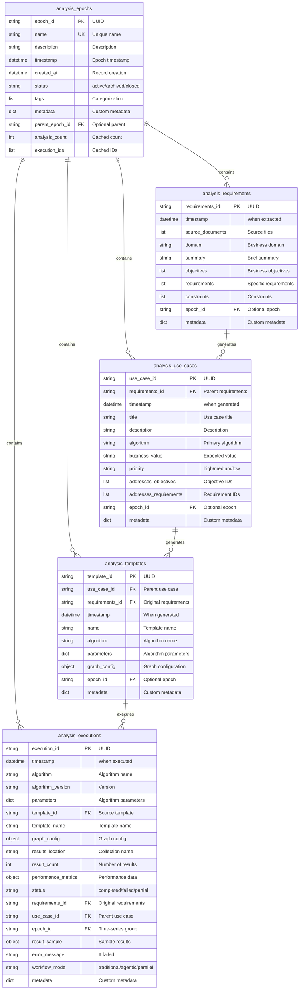

# Analysis Catalog - Graph Schema

## Overview

The Analysis Catalog uses **5 ArangoDB collections** to track analysis executions, lineage, and time-series data. Here's the complete schema with relationships.

---

## Entity-Relationship Diagram



---

## Collection Details

### 1. `analysis_executions` (Core Entity)

**Purpose:** Tracks every single analysis run through the system.

**Key Fields:**
- `execution_id` (PK) - Unique identifier
- `algorithm` - Algorithm name (e.g., "pagerank", "wcc")
- `parameters` - Algorithm-specific parameters
- `graph_config` - Graph configuration at execution time
- `results_location` - Where results are stored
- `performance_metrics` - Timing, memory, CPU usage
- `status` - completed/failed/partial

**Lineage Foreign Keys:**
- `requirements_id` → `analysis_requirements`
- `use_case_id` → `analysis_use_cases`
- `template_id` → `analysis_templates`
- `epoch_id` → `analysis_epochs`

**Indexes:**
```
timestamp (skiplist) - Time-series queries
algorithm (hash) - Filter by algorithm
epoch_id (hash) - Filter by epoch
status (hash) - Filter by status
requirements_id (hash) - Lineage queries
use_case_id (hash) - Lineage queries
template_id (hash) - Lineage queries
[epoch_id, timestamp] (multi) - Composite queries
```

**Sample Document:**
```json
{
 "_key": "exec-12345",
 "execution_id": "exec-12345",
 "timestamp": "2026-01-07T10:30:00Z",
 "algorithm": "pagerank",
 "algorithm_version": "1.0",
 "parameters": {
 "damping": 0.85,
 "max_iterations": 100
 },
 "template_id": "tmpl-67890",
 "template_name": "E-commerce Influence Analysis",
 "graph_config": {
 "graph_name": "ecommerce_graph",
 "graph_type": "named_graph",
 "vertex_collections": ["customers", "products"],
 "edge_collections": ["purchases", "reviews"],
 "vertex_count": 10000,
 "edge_count": 50000
 },
 "results_location": "pagerank_results",
 "result_count": 10000,
 "performance_metrics": {
 "execution_time_seconds": 45.3,
 "memory_usage_mb": 512.0,
 "cpu_time_seconds": 120.5
 },
 "status": "completed",
 "requirements_id": "req-11111",
 "use_case_id": "uc-22222",
 "epoch_id": "epoch-2026-01-07",
 "workflow_mode": "agentic",
 "metadata": {
 "user": "analyst@company.com",
 "department": "marketing"
 }
}
```

---

### 2. `analysis_epochs` (Time-Series Grouping)

**Purpose:** Groups analyses into time periods for time-series analysis.

**Key Fields:**
- `epoch_id` (PK) - Unique identifier
- `name` (UK) - Unique human-readable name
- `timestamp` - When this epoch represents
- `status` - active/archived/closed
- `tags` - Categorization (e.g., "production", "monthly")

**Indexes:**
```
name (hash, unique) - Lookup by name
timestamp (skiplist) - Time-based queries
status (hash) - Filter by status
```

**Sample Document:**
```json
{
 "_key": "epoch-2026-01-07",
 "epoch_id": "epoch-2026-01-07",
 "name": "2026-01-07-snapshot",
 "description": "Weekly snapshot of e-commerce graph",
 "timestamp": "2026-01-07T00:00:00Z",
 "created_at": "2026-01-07T10:00:00Z",
 "status": "active",
 "tags": ["production", "weekly", "ecommerce"],
 "metadata": {
 "graph_version": "v2.3",
 "data_source": "production"
 },
 "parent_epoch_id": null,
 "analysis_count": 5,
 "execution_ids": ["exec-12345", "exec-12346", "exec-12347"]
}
```

---

### 3. `analysis_requirements` (Agentic Workflow)

**Purpose:** Tracks requirements extracted by the RequirementsAgent.

**Key Fields:**
- `requirements_id` (PK) - Unique identifier
- `source_documents` - Original requirement files
- `domain` - Business domain
- `objectives` - Business objectives
- `requirements` - Specific requirements

**Indexes:**
```
timestamp (skiplist) - Time-based queries
domain (hash) - Filter by domain
epoch_id (hash) - Filter by epoch
```

**Sample Document:**
```json
{
 "_key": "req-11111",
 "requirements_id": "req-11111",
 "timestamp": "2026-01-07T10:00:00Z",
 "source_documents": ["ecommerce_requirements.pdf"],
 "domain": "E-commerce",
 "summary": "Analyze customer influence and product recommendations",
 "objectives": [
 {
 "id": "OBJ-001",
 "title": "Identify influential customers",
 "description": "Find customers who drive the most purchases"
 }
 ],
 "requirements": [
 {
 "id": "REQ-001",
 "text": "Calculate customer influence scores",
 "type": "functional"
 }
 ],
 "constraints": ["Must complete within 5 minutes"],
 "epoch_id": "epoch-2026-01-07",
 "metadata": {}
}
```

---

### 4. `analysis_use_cases` (Agentic Workflow)

**Purpose:** Tracks use cases generated by the UseCaseAgent.

**Key Fields:**
- `use_case_id` (PK) - Unique identifier
- `requirements_id` (FK) - Parent requirements
- `algorithm` - Primary algorithm
- `addresses_objectives` - Which objectives this addresses
- `addresses_requirements` - Which requirements this addresses

**Indexes:**
```
requirements_id (hash) - Lineage queries
timestamp (skiplist) - Time-based queries
algorithm (hash) - Filter by algorithm
```

**Sample Document:**
```json
{
 "_key": "uc-22222",
 "use_case_id": "uc-22222",
 "requirements_id": "req-11111",
 "timestamp": "2026-01-07T10:15:00Z",
 "title": "Customer Influence Analysis",
 "description": "Use PageRank to identify most influential customers",
 "algorithm": "pagerank",
 "business_value": "Target marketing campaigns at influential customers",
 "priority": "high",
 "addresses_objectives": ["OBJ-001"],
 "addresses_requirements": ["REQ-001"],
 "epoch_id": "epoch-2026-01-07",
 "metadata": {}
}
```

---

### 5. `analysis_templates` (Agentic Workflow)

**Purpose:** Tracks templates generated by the TemplateAgent.

**Key Fields:**
- `template_id` (PK) - Unique identifier
- `use_case_id` (FK) - Parent use case
- `requirements_id` (FK) - Original requirements
- `algorithm` - Algorithm name
- `parameters` - Algorithm parameters
- `graph_config` - Graph configuration

**Indexes:**
```
use_case_id (hash) - Lineage queries
requirements_id (hash) - Lineage queries
algorithm (hash) - Filter by algorithm
```

**Sample Document:**
```json
{
 "_key": "tmpl-67890",
 "template_id": "tmpl-67890",
 "use_case_id": "uc-22222",
 "requirements_id": "req-11111",
 "timestamp": "2026-01-07T10:20:00Z",
 "name": "E-commerce Influence Analysis",
 "algorithm": "pagerank",
 "parameters": {
 "damping": 0.85,
 "max_iterations": 100,
 "threshold": 0.0001
 },
 "graph_config": {
 "graph_name": "ecommerce_graph",
 "graph_type": "named_graph",
 "vertex_collections": ["customers", "products"],
 "edge_collections": ["purchases", "reviews"]
 },
 "epoch_id": "epoch-2026-01-07",
 "metadata": {
 "gae_engine_size": "e16"
 }
}
```

---

## Lineage Relationships

### Complete Lineage Chain (Agentic Workflow)

```
analysis_requirements (req-11111)
 ↓ generates
analysis_use_cases (uc-22222)
 ↓ generates
analysis_templates (tmpl-67890)
 ↓ executes
analysis_executions (exec-12345)
```

All entities can optionally belong to an `analysis_epochs` for time-series grouping.

### Query Examples

**Forward Tracing (Requirements → Executions):**
```python
# Find all executions that came from a specific requirement
lineage = tracker.trace_requirement_forward(requirements_id="req-11111")
# Returns: use cases, templates, and executions
```

**Backward Tracing (Execution → Requirements):**
```python
# Find the original requirements for an execution
lineage = catalog.get_execution_lineage(execution_id="exec-12345")
# Returns: requirements, use case, template, and execution
```

**Impact Analysis:**
```python
# What would be affected if requirements change?
impact = tracker.analyze_impact(requirements_id="req-11111")
# Returns: affected use cases, templates, and executions
```

---

## Time-Series Schema

### Multi-Epoch Tracking

```
epoch-2026-01-01 (customers: 1000, products: 500)
 exec-001 (pagerank: avg=0.45)
 exec-002 (betweenness: avg=0.22)
 exec-003 (wcc: components=5)

epoch-2026-01-08 (customers: 1100, products: 550)
 exec-004 (pagerank: avg=0.48) ← +6.7% increase
 exec-005 (betweenness: avg=0.25) ← +13.6% increase
 exec-006 (wcc: components=4) ← -20% (more connected!)

epoch-2026-01-15 (customers: 1200, products: 600)
 exec-007 (pagerank: avg=0.51) ← +13.3% total increase
 exec-008 (betweenness: avg=0.27) ← +22.7% total increase
 exec-009 (wcc: components=3) ← -40% (highly connected!)
```

**Query Pattern:**
```python
# Get all PageRank executions across epochs
executions = catalog.query_executions(
 filter=ExecutionFilter(algorithm="pagerank"),
 sort=[SortOption(field="timestamp", ascending=True)]
)

# Analyze trend
for exec in executions:
 print(f"{exec.timestamp}: {exec.result_sample.top_values[0]}")
```

---

## Workflow-Specific Usage

### Traditional Workflow (No Lineage)

```
analysis_epochs
 ↓ contains
analysis_executions (standalone)
```

Only `epochs` and `executions` are used. No requirements, use cases, or templates.

### Agentic Workflow (Full Lineage)

```
analysis_epochs
 ↓ contains
analysis_requirements
 ↓ generates
analysis_use_cases
 ↓ generates
analysis_templates
 ↓ executes
analysis_executions
```

All 5 collections are used for complete lineage tracking.

---

## Common Query Patterns

### 1. Find All Executions in an Epoch
```python
executions = catalog.query_executions(
 filter=ExecutionFilter(epoch_id="epoch-2026-01-07")
)
```

### 2. Find Failed Executions
```python
from graph_analytics_ai.catalog.models import ExecutionStatus

failed = catalog.query_executions(
 filter=ExecutionFilter(status=ExecutionStatus.FAILED)
)
```

### 3. Find Executions by Algorithm
```python
pagerank_runs = catalog.query_executions(
 filter=ExecutionFilter(algorithm="pagerank")
)
```

### 4. Get Complete Lineage
```python
lineage = catalog.get_execution_lineage(execution_id="exec-12345")
print(f"Requirements: {lineage.requirements.summary}")
print(f"Use Case: {lineage.use_case.title}")
print(f"Template: {lineage.template.name}")
print(f"Execution: {lineage.execution.algorithm}")
```

### 5. Time-Series Analysis
```python
# Get all epochs in time order
epochs = catalog.query_epochs(
 sort=[SortOption(field="timestamp", ascending=True)]
)

# Get PageRank results for each epoch
for epoch in epochs:
 execs = catalog.query_executions(
 filter=ExecutionFilter(
 epoch_id=epoch.epoch_id,
 algorithm="pagerank"
 )
 )
 print(f"{epoch.name}: {len(execs)} PageRank executions")
```

---

## Storage Size Estimates

### Per-Entity Size
- **Execution**: ~2-5 KB (with performance metrics and samples)
- **Epoch**: ~1 KB
- **Requirements**: ~5-10 KB (with objectives and requirements)
- **Use Case**: ~2-3 KB
- **Template**: ~2-3 KB

### Scalability
- **1,000 executions/day** → ~2-5 MB/day → ~750 MB - 1.8 GB/year
- **10,000 executions/day** → ~20-50 MB/day → ~7.5 - 18 GB/year
- **100,000 executions/day** → ~200-500 MB/day → ~75 - 180 GB/year

ArangoDB handles millions of documents efficiently with proper indexing.

---

## Summary

The Analysis Catalog uses a **star schema** with `analysis_executions` at the center and dimension tables for:
- **Time** (epochs)
- **Lineage** (requirements → use cases → templates)
- **Metadata** (flexible JSON fields)

This design enables:
- Fast queries by any dimension
- Complete lineage tracking
- Time-series analysis
- Impact analysis
- Performance comparison
- Flexible metadata storage

**Production Status:** Tested with real ArangoDB, all indexes created, schema validated

