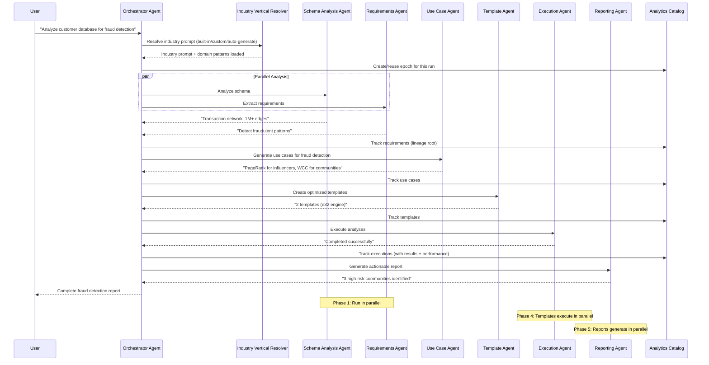
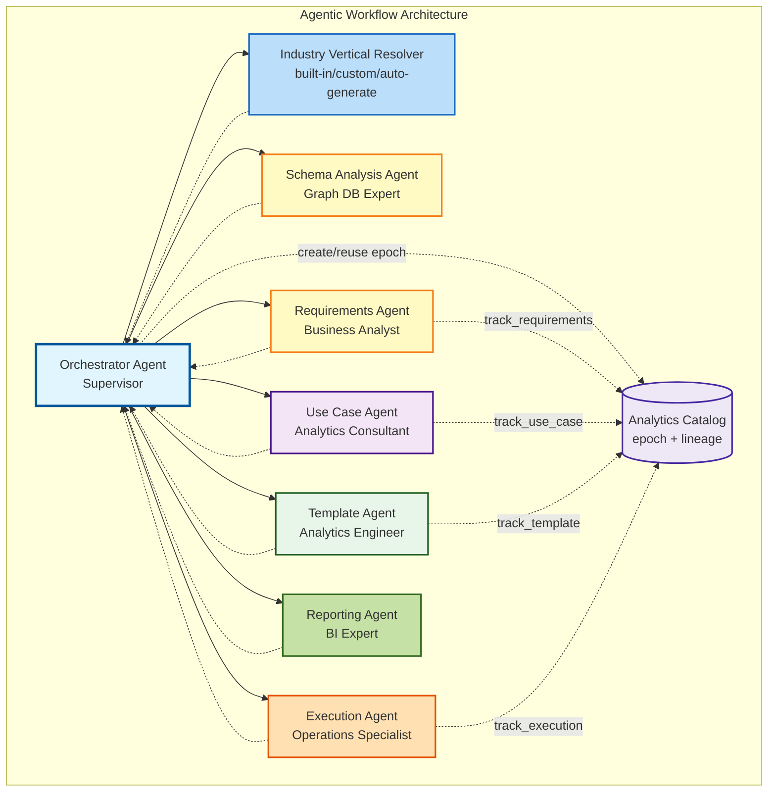

# Agentic Workflow Analysis

## Is This Project a Candidate for Agentic Workflow?

**Short Answer: Yes, this project is an excellent candidate for an agentic workflow approach.**

## Current Workflow (Linear/Orchestrated)

The current design follows a **linear orchestrated workflow**:
1. Step 1 → Step 2 → Step 3 → ... → Step 7
2. Each step executes in sequence
3. Decisions are made by LLM prompts, not autonomous agents
4. Limited ability to adapt or reason about intermediate results

## Why Agentic Workflow Would Be Beneficial

### 1. Complex Decision-Making Requirements

**Current Challenge:** The workflow requires making complex decisions at multiple points:
- Which graph algorithms are most appropriate for specific business requirements?
- How to optimize analysis parameters based on graph size and structure?
- How to interpret results and generate actionable recommendations?

**Agentic Solution:** Specialized agents can reason about these decisions:
- **Schema Analysis Agent:** Analyzes graph structure and identifies patterns
- **Algorithm Selection Agent:** Chooses optimal algorithms based on requirements and schema
- **Optimization Agent:** Adjusts parameters and engine sizes based on graph characteristics
- **Interpretation Agent:** Reasons about results and generates insights

### 2. Multi-Domain Expertise

**Current Challenge:** The workflow spans multiple domains:
- Graph database schema understanding
- Business requirements analysis
- Algorithm selection and configuration
- Result interpretation and business intelligence

**Agentic Solution:** Domain-specific agents:
- **Business Analyst Agent:** Understands business requirements and objectives
- **Graph Schema Agent:** Expert in graph database structures and patterns
- **Analytics Agent:** Expert in graph algorithms and their applications
- **Reporting Agent:** Expert in translating technical results to business insights

### 3. Adaptive Workflow Execution

**Current Challenge:** Linear workflow doesn't adapt to:
- Unexpected schema patterns
- Missing or incomplete requirements
- Analysis results that suggest different approaches
- Errors or edge cases

**Agentic Solution:** Agents can:
- **Reason about next steps** based on current state
- **Adapt the workflow** when unexpected situations arise
- **Make autonomous decisions** about retries, alternatives, or optimizations
- **Collaborate** with other agents to solve complex problems

### 4. Quality and Validation

**Current Challenge:** Validation happens at fixed points, may miss issues

**Agentic Solution:** Validation agents can:
- **Continuously monitor** workflow progress
- **Validate outputs** at each step
- **Suggest improvements** or corrections
- **Ensure consistency** across the workflow

## Proposed Agentic Architecture

### Agent Types

#### 1. **Orchestrator Agent** (Supervisor)
- **Role:** Coordinates all other agents
- **Responsibilities:**
 - Break down high-level goals into tasks
 - Assign tasks to appropriate agents
 - Monitor progress and handle errors
 - Make strategic decisions about workflow direction

#### 2. **Schema Analysis Agent**
- **Role:** Expert in graph database schemas
- **Responsibilities:**
 - Extract and analyze graph structure
 - Identify patterns and relationships
 - Detect anomalies or issues
 - Generate schema insights

#### 3. **Business Requirements Agent**
- **Role:** Expert in business analysis
- **Responsibilities:**
 - Extract and structure business requirements
 - Identify business objectives and success criteria
 - Map requirements to graph analytics capabilities
 - Validate requirement completeness

#### 4. **PRD Generation Agent**
- **Role:** Technical writer and analyst
- **Responsibilities:**
 - Synthesize requirements and schema insights
 - Generate comprehensive PRD
 - Ensure technical feasibility
 - Validate against best practices

#### 5. **Use Case Generation Agent**
- **Role:** Analytics consultant
- **Responsibilities:**
 - Map business requirements to graph algorithms
 - Generate use cases with business value
 - Validate use case feasibility
 - Prioritize use cases by impact

#### 6. **Template Generation Agent**
- **Role:** Analytics engineer
- **Responsibilities:**
 - Convert use cases to analysis templates
 - Optimize algorithm parameters
 - Configure engine sizes
 - Validate template correctness

#### 7. **Analysis Execution Agent**
- **Role:** Operations specialist
- **Responsibilities:**
 - Execute analyses using GAE orchestrator
 - Monitor execution progress
 - Handle errors and retries
 - Optimize resource usage

#### 8. **Result Interpretation Agent**
- **Role:** Data scientist and business analyst
- **Responsibilities:**
 - Analyze analysis results
 - Interpret metrics in business context
 - Generate insights and recommendations
 - Identify actionable intelligence

#### 9. **Report Generation Agent**
- **Role:** Technical writer
- **Responsibilities:**
 - Synthesize all information into comprehensive report
 - Format for different audiences
 - Ensure clarity and actionability
 - Generate visualizations

#### 10. **Quality Assurance Agent**
- **Role:** Validator and reviewer
- **Responsibilities:**
 - Validate outputs at each step
 - Check for consistency and quality
 - Suggest improvements
 - Ensure compliance with standards

### Agent Communication

Agents communicate through:
- **Shared State:** Common workspace with intermediate results
- **Messages:** Structured messages for coordination
- **Tools:** Shared tools (LLM, database, file system)
- **Events:** Event-driven coordination for async operations

### Example Agentic Workflow

**Key Steps:**

1. **Orchestrator** receives goal: "Analyze customer database for fraud detection"
2. **Parallel Analysis**: Schema Analysis + Requirements Extraction run concurrently
3. **Schema Agent** identifies: "Transaction network with 1M+ edges"
4. **Requirements Agent** extracts: "Detect fraudulent transaction patterns"
5. **Use Case Agent** generates: "PageRank for influential nodes, WCC for communities"
6. **Template Agent** configures: "e32 engine for 1M+ edges"
7. **Execution Agent** runs analyses and monitors progress
8. **Reporting Agent** creates actionable report with insights

## Benefits of Agentic Approach

### 1. **Autonomous Decision-Making**
- Agents can make decisions without human intervention
- Adapt to unexpected situations
- Optimize based on intermediate results

### 2. **Specialized Expertise**
- Each agent is an expert in its domain
- Better quality outputs
- More accurate recommendations

### 3. **Adaptive Workflow**
- Workflow can change based on findings
- Agents can suggest alternative approaches
- Handle edge cases gracefully

### 4. **Quality Assurance**
- Continuous validation
- Quality checks at every step
- Consistency across outputs

### 5. **Scalability**
- Agents can work in parallel where possible
- Better resource utilization
- Faster execution

### 6. **Explainability**
- Each agent can explain its decisions
- Better audit trail
- Easier debugging

## Implementation Considerations

### Framework Options

1. **LangGraph** (Recommended)
 - Built for agentic workflows
 - State management
 - Conditional routing
 - Human-in-the-loop support

2. **AutoGen**
 - Multi-agent conversations
 - Tool use
 - Code execution

3. **CrewAI**
 - Role-based agents
 - Task delegation
 - Collaboration patterns

4. **Custom Framework**
 - Full control
 - Lightweight
 - Customized to needs

### Architecture Pattern

**Recommended: Supervisor Pattern with Specialized Agents**

**Agent Roles:**
- **Orchestrator**: Coordinates all agents, makes strategic decisions
- **Schema/Requirements**: Parallel analysis of data and business needs
- **Use Case**: Maps requirements to graph algorithms
- **Template**: Configures and optimizes analysis templates
- **Execution**: Runs analyses, monitors progress, handles errors
- **Reporting**: Generates actionable insights and recommendations

### State Management

- **Shared State:** Graph state with all intermediate results
- **Agent State:** Individual agent memory and context
- **Workflow State:** Current step, progress, errors

### Tool Integration

Agents have access to:
- **LLM Provider:** For reasoning and generation
- **Database Connection:** For schema analysis and queries
- **GAE Orchestrator:** For analysis execution
- **File System:** For reading/writing documents
- **Validation Tools:** For quality checks

## Migration Path

### Phase 1: Hybrid Approach (v2.1.0)
- Keep linear workflow as fallback
- Add agentic mode as optional
- Test with simple use cases

### Phase 2: Agentic Core (v2.2.0)
- Make agentic workflow default
- Keep linear workflow for simple cases
- Add agent collaboration

### Phase 3: Advanced Agents (v2.3.0)
- Add learning capabilities
- Multi-agent collaboration
- Advanced reasoning

## Comparison: Linear vs Agentic

| Aspect | Linear Workflow | Agentic Workflow |
|--------|----------------|------------------|
| **Decision Making** | LLM prompts | Autonomous agents |
| **Adaptability** | Limited | High |
| **Quality** | Good | Excellent |
| **Complexity** | Lower | Higher |
| **Execution Speed** | Sequential | Can parallelize |
| **Error Handling** | Fixed retry logic | Adaptive recovery |
| **Explainability** | Limited | High (agent reasoning) |
| **Maintenance** | Easier | More complex |

## Recommendation

**Yes, implement agentic workflow, but with a phased approach:**

1. **Start with Linear** (v2.0.0) - Get the workflow working
2. **Add Agentic Mode** (v2.1.0) - Optional agentic execution
3. **Make Agentic Default** (v2.2.0) - When proven and stable
4. **Enhance Agents** (v2.3.0) - Add learning and collaboration

## Next Steps

1. **Evaluate Frameworks:** Test LangGraph, AutoGen, CrewAI
2. **Design Agent Architecture:** Define agent roles and communication
3. **Create Prototype:** Build simple agentic workflow
4. **Compare Results:** Linear vs Agentic on same use cases
5. **Decide on Approach:** Based on results and complexity

## Conclusion

This project is **highly suitable** for an agentic workflow because:
- Complex decision-making required
- Multiple domains of expertise
- Need for adaptive execution
- Quality and validation important
- Explainability valuable

The agentic approach will provide:
- Better decision-making
- Higher quality outputs
- More adaptive workflows
- Better user experience

**Recommendation:** Implement agentic workflow as v2.1.0 enhancement, with linear workflow as fallback.

